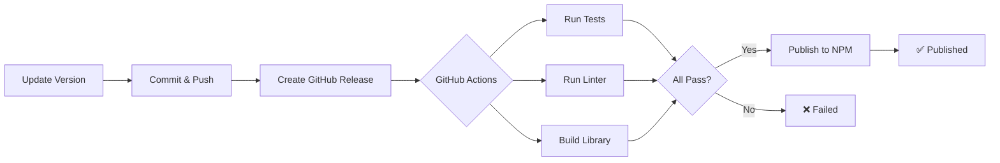

# News Widget - Instagram-Style Video Feed

An embeddable, responsive news feed component with Instagram-style video playback, swipe gestures, and real-time comments. Built with React 19, TypeScript, and Vite.

## ✨ Features

- 📱 **Instagram-style UI** - Vertical scrolling feed with full-screen video viewer
- 🎥 **Multi-format media** - Supports YouTube videos, MP4 files, and images
- 👆 **Touch-optimized** - Swipe gestures for navigation (mobile-first)
- 🎬 **Auto-play** - Videos play automatically when visible, pause when scrolled away
- 💬 **Real-time comments** - Fetch and post comments via Discourse integration
- 🎨 **Themeable** - Respects parent page color schemes via CSS custom properties
- ♿ **Accessibility-first** - Full ARIA support, keyboard navigation, screen reader tested
- 🌐 **RSS-powered** - Parses standard RSS feeds with media enclosures

## 🚀 Quick Start

### Development

```bash
cd news-widget
npm install
npm run dev        # Start dev server at http://localhost:5173
npm run build      # Build for production
npm run preview    # Preview production build
```

### Testing

```bash
npm test           # Run Playwright E2E tests
npm run test:ui    # Open Playwright UI
npm run test:headed # Run tests in headed mode
```

## 📦 Embedding the Widget

### Option 1: NPM Package (Recommended for React Apps)

Install the widget as an NPM dependency:

```bash
npm install @mieweb/news-widget
# or
yarn add @mieweb/news-widget
# or
pnpm add @mieweb/news-widget
```

#### Using as a React Component

```tsx
import { NewsWidget } from '@mieweb/news-widget';
import '@mieweb/news-widget/style.css';

function App() {
  return (
    <div className="my-app">
      <h1>Latest News</h1>
      {/* Show landing page with all feeds */}
      <NewsWidget />

      {/* Or render a specific feed directly */}
      <NewsWidget feedId="features" />
    </div>
  );
}
```

#### Using with Vanilla JavaScript

```js
import { renderNewsWidget } from '@mieweb/news-widget';
import '@mieweb/news-widget/style.css';

// Show landing page with all feeds
renderNewsWidget(document.getElementById('news-feed'));

// Or render a specific registered feed directly (no landing page)
renderNewsWidget(document.getElementById('news-feed'), { feedId: 'features' });
```

#### Advanced Usage: Custom Hooks & Components

```tsx
import { useFeed, Feed, FeedCard } from '@mieweb/news-widget';
import '@mieweb/news-widget/style.css';
import type { Post } from '@mieweb/news-widget';

function CustomFeed() {
  const { posts, loading, error } = useFeed('https://example.com/feed.rss');
  
  if (loading) return <div>Loading...</div>;
  if (error) return <div>Error: {error}</div>;
  
  return (
    <div>
      {posts.map((post: Post) => (
        <FeedCard key={post.id} post={post} />
      ))}
    </div>
  );
}
```

### Option 2: Build from Source

Build the widget yourself for full control:

```bash
npm run build
```

This creates optimized files in the `dist/` folder:
- `dist/index.html` - Main HTML entry point
- `dist/assets/*.js` - JavaScript bundles
- `dist/assets/*.css` - Stylesheets

### Option 3: Basic HTML Embedding (No Build Tools)

Copy the `dist/` folder to your web server and embed with an iframe:

```html
<!DOCTYPE html>
<html>
<head>
  <title>My Website</title>
  <style>
    /* Make iframe responsive and full-height */
    .news-widget-container {
      width: 100%;
      height: 600px; /* Or use 100vh for full viewport */
      border: none;
      overflow: hidden;
    }
  </style>
</head>
<body>
  <h1>Latest News</h1>
  
  <!-- Embed the news widget -->
  <iframe 
    src="/dist/index.html" 
    class="news-widget-container"
    title="News Feed Widget"
    sandbox="allow-scripts allow-same-origin allow-popups"
  ></iframe>
</body>
</html>
```

#### Embedding a Specific Feed via iframe

To show a specific feed without the landing page, use the IIFE build with `feedId`:

```html
<!-- widget.html -->
<!DOCTYPE html>
<html>
<head>
  <link rel="stylesheet" href="news-widget.css">
</head>
<body>
  <div id="root"></div>
  <script src="news-widget.iife.js"></script>
  <script>
    var params = new URLSearchParams(window.location.search);
    var feedId = params.get('feedId');
    NewsWidget.renderNewsWidget(
      document.getElementById('root'),
      feedId ? { feedId: feedId } : {}
    );
  </script>
</body>
</html>
```

Then embed with a query parameter to select the feed:

```html
<!-- Enterprise Health feeds (pre-registered) -->
<iframe src="widget.html?feedId=features" title="Features Feed"></iframe>
<iframe src="widget.html?feedId=testing" title="Testing Feed"></iframe>
<iframe src="widget.html?feedId=public" title="Public Feed"></iframe>
```

#### Embedding a Custom Feed via iframe

Use `registerFeed()` to add a custom feed at runtime before rendering:

```html
<!-- custom-widget.html -->
<!DOCTYPE html>
<html>
<head>
  <link rel="stylesheet" href="news-widget.css">
</head>
<body>
  <div id="root"></div>
  <script src="news-widget.iife.js"></script>
  <script>
    var params = new URLSearchParams(window.location.search);
    var feedUrl = params.get('feed');
    var feedName = params.get('name') || 'News';

    if (feedUrl) {
      NewsWidget.registerFeed({
        id: 'custom',
        name: feedName,
        url: feedUrl,
        description: '',
        emoji: '📰',
        capabilities: { supportsLikes: true, supportsComments: true }
      });
    }

    NewsWidget.renderNewsWidget(
      document.getElementById('root'),
      feedUrl ? { feedId: 'custom' } : {}
    );
  </script>
</body>
</html>
```

```html
<iframe src="custom-widget.html?feed=https://example.com/feed.rss&name=My+Feed"></iframe>
```

#### Direct Integration (No iframe)

For tighter integration, include the built assets directly:

```html
<!DOCTYPE html>
<html>
<head>
  <title>My Website</title>
  <!-- Include widget styles -->
  <link rel="stylesheet" href="/dist/assets/index-[hash].css">
</head>
<body>
  <!-- Widget mounts here -->
  <div id="root"></div>
  
  <!-- Include widget JavaScript -->
  <script type="module" src="/dist/assets/index-[hash].js"></script>
</body>
</html>
```

> **Note:** Replace `[hash]` with the actual hash from your build output.

### Option 4: CDN (Coming Soon)

Use a CDN for quick prototyping without installation:

```html
<link rel="stylesheet" href="https://unpkg.com/@mieweb/news-widget/style.css">
<script type="module">
  import { renderNewsWidget } from 'https://unpkg.com/@mieweb/news-widget';
  renderNewsWidget(document.getElementById('news-feed'));
</script>
```

## 🎨 Customizing Colors & Styles

The widget uses **CSS custom properties** for theming, making it easy to match your site's design.

### Override Default Colors

Add this CSS to your parent page (before or after the iframe):

```html
<style>
  /* Define your site's color scheme */
  :root {
    /* Background colors */
    --news-widget-bg: #ffffff;
    --news-widget-card-bg: #f9f9f9;
    
    /* Text colors */
    --news-widget-text: #333333;
    --news-widget-text-secondary: #666666;
    
    /* Accent colors */
    --news-widget-primary: #0066cc;
    --news-widget-border: #e0e0e0;
    
    /* Interactive elements */
    --news-widget-button-hover: #f0f0f0;
    --news-widget-link-color: #0066cc;
  }
</style>
```

### Dark Mode Support

The widget respects the system color scheme. Add dark mode overrides:

```html
<style>
  @media (prefers-color-scheme: dark) {
    :root {
      --news-widget-bg: #1a1a1a;
      --news-widget-card-bg: #2a2a2a;
      --news-widget-text: #e0e0e0;
      --news-widget-text-secondary: #a0a0a0;
      --news-widget-border: #404040;
      --news-widget-button-hover: #333333;
    }
  }
</style>
```

### Available CSS Custom Properties

| Property | Default (Light) | Purpose |
|----------|-----------------|---------|
| `--news-widget-bg` | `#fafafa` | Main background color |
| `--news-widget-card-bg` | `#ffffff` | Card/container background |
| `--news-widget-text` | `#262626` | Primary text color |
| `--news-widget-text-secondary` | `#8e8e8e` | Secondary/muted text |
| `--news-widget-primary` | `#0095f6` | Primary accent (links, buttons) |
| `--news-widget-border` | `#dbdbdb` | Border and divider color |
| `--news-widget-button-hover` | `rgba(0,0,0,0.05)` | Button hover state |
| `--news-widget-error` | `#ed4956` | Error messages |
| `--news-widget-success` | `#00c853` | Success indicators |

### Example: Brand Integration

Match your brand colors:

```html
<style>
  :root {
    /* Your brand palette */
    --news-widget-bg: var(--your-site-bg, #f5f5f5);
    --news-widget-primary: var(--your-brand-primary, #ff6b35);
    --news-widget-text: var(--your-site-text, #2d3748);
  }
</style>
```

## 🔧 Configuration

### RSS Feed Sources

Feeds can be configured statically in [src/data/feedRegistry.ts](src/data/feedRegistry.ts), or registered at runtime.

#### Static Registration (build-time)

Add feeds to the `FEED_SECTIONS` array in `feedRegistry.ts`:

```typescript
{
  id: 'my-feed',
  name: 'My News Feed',
  description: 'Latest updates',
  url: 'https://example.com/feed.rss',
  emoji: '📰',
  capabilities: { supportsLikes: true, supportsComments: true },
}
```

#### Runtime Registration

Use `registerFeed()` to add or override feeds before rendering — useful for iframe embedding or dynamic configuration:

```js
import { registerFeed, renderNewsWidget } from '@mieweb/news-widget';

registerFeed({
  id: 'custom',
  name: 'Custom Feed',
  description: 'Dynamically registered',
  url: 'https://example.com/feed.rss',
  emoji: '📰',
  capabilities: { supportsLikes: true, supportsComments: true },
});

renderNewsWidget(document.getElementById('root'), { feedId: 'custom' });
```

#### Available Feed IDs

| Feed ID | Name | Source |
|---------|------|--------|
| `features` | Features | Enterprise Health product announcements |
| `testing` | Test | Enterprise Health testing discussions |
| `public` | Public | Enterprise Health public community |
| `test-server` | Test Server | Local development test server |
| `sample` | Sample Feed | Built-in demo content |

### Proxy Configuration

For development, configure CORS proxies in [vite.config.ts](vite.config.ts):

```typescript
server: {
  proxy: {
    '/api/rss': {
      target: 'https://your-discourse-instance.com',
      changeOrigin: true,
      rewrite: (path) => path.replace(/^\/api\/rss/, ''),
    },
  },
}
```

## 📱 Mobile Optimization

The widget is mobile-first with touch gestures:

- **Swipe up/down** - Navigate between posts
- **Tap video** - Toggle play/pause
- **Tap muted icon** - Unmute audio
- **Tap comment icon** - Open comment panel
- **Tap outside** - Close comment panel

### Responsive Breakpoints

```css
/* Mobile: default styles */
/* Tablet: 768px+ */
/* Desktop: 1024px+ */
```

## ♿ Accessibility

Built with WCAG 2.1 AA compliance:

- ✅ Full keyboard navigation (Tab, Enter, Escape)
- ✅ ARIA labels on all interactive elements
- ✅ Screen reader tested (VoiceOver, NVDA)
- ✅ Focus indicators on all controls
- ✅ Semantic HTML structure
- ✅ Color contrast meets AA standards

### Keyboard Shortcuts

| Key | Action |
|-----|--------|
| `Tab` | Navigate between elements |
| `Enter` / `Space` | Activate buttons/links |
| `Escape` | Close comment panel or fullscreen viewer |
| `Arrow Up/Down` | Scroll feed (when focused) |

## 🧪 Testing

Playwright E2E tests verify:
- Video playback and autoplay
- Comment posting and syncing
- Like/unlike functionality
- Swipe gesture navigation
- Fullscreen viewer interactions
- Accessibility (ARIA roles, keyboard nav)

```bash
npm test                 # Run all tests
npm run test:ui          # Interactive test UI
npm run test:headed      # See tests in browser
```

## 🏗️ Architecture

```
news-widget/
├── src/
│   ├── components/      # React components
│   │   ├── Feed.tsx           # Main feed container
│   │   ├── FeedCard.tsx       # Individual post card
│   │   ├── FullscreenViewer.tsx  # Fullscreen video viewer
│   │   ├── CommentsPanel.tsx  # Comment sidebar
│   │   └── Avatar.tsx         # User avatar
│   ├── hooks/           # Custom React hooks
│   │   ├── useFeed.ts         # RSS feed fetching/parsing
│   │   ├── useComments.ts     # Comment state management
│   │   ├── useVisibility.ts   # IntersectionObserver for autoplay
│   │   ├── useRouter.ts       # URL routing
│   │   └── useDiscourseAuth.ts # Authentication
│   ├── types/           # TypeScript interfaces
│   └── data/            # Feed configuration
└── test-server/         # Development test server
```

## 🔒 Security Notes

When embedding via iframe, use appropriate `sandbox` attributes:

```html
<iframe 
  sandbox="allow-scripts allow-same-origin allow-popups allow-forms"
  src="/dist/index.html">
</iframe>
```

- `allow-scripts` - Required for JavaScript execution
- `allow-same-origin` - Required for API calls to parent domain
- `allow-popups` - For external links
- `allow-forms` - For comment submission

## 📝 License

[Add your license here]

## 🤝 Contributing

See project [copilot-instructions.md](.github/copilot-instructions.md) for code quality guidelines.

## 👨‍💻 Development

### Tech Stack

- **React 19** - Latest React with concurrent features
- **TypeScript 5.9** - Type-safe development
- **Vite 7** - Fast build tool and dev server
- **react-player v3** - Multi-format video playback
- **react-swipeable** - Touch gesture handling
- **Playwright** - E2E testing

### Project Commands

```bash
npm run dev        # Start dev server (http://localhost:5173)
npm run build      # Production build → dist/ (for standalone app)
npm run build:lib  # Library build → dist/ (for NPM package)
npm run preview    # Preview production build
npm run lint       # Run ESLint
npm test           # Run Playwright tests
npm run test:ui    # Open Playwright UI for debugging
```

### Building for NPM

To build the library version for NPM distribution:

```bash
npm run build:lib
```

This generates:
- `dist/news-widget.js` - ES module
- `dist/news-widget.umd.cjs` - UMD module (browser globals)
- `dist/news-widget.css` - Compiled styles
- `dist/index.d.ts` - TypeScript declarations

### Publishing to NPM

**Automated Publishing (Recommended)**

Create a GitHub Release and the package is automatically published via GitHub Actions:



**Steps**:
1. Update version in package.json (`npm version patch/minor/major`)
2. Commit and push the version bump
3. Create a GitHub Release with tag `vX.Y.Z`
4. GitHub Actions workflow automatically runs and publishes to NPM

**Manual Publishing**

```bash
# Test the package locally first
npm run build:lib
npm pack

# Publish to NPM (requires auth)
npm login
npm publish --access public
```

**Resources**:
- 🔧 [EXAMPLES.md](EXAMPLES.md) - Usage examples

### Code Quality

This project follows strict quality guidelines:

- **DRY principle** - No code duplication
- **KISS principle** - Simplest solution that works
- **Accessibility-first** - ARIA labels, keyboard navigation
- **Test-driven** - E2E tests for all features
- **Type-safe** - Full TypeScript coverage

See [.github/copilot-instructions.md](.github/copilot-instructions.md) for complete guidelines.

### ESLint Configuration

The project uses flat config ESLint 9 with TypeScript support. To enable stricter type-aware rules:

```js
// eslint.config.js
import tseslint from 'typescript-eslint';

export default defineConfig([
  globalIgnores(['dist']),
  {
    files: ['**/*.{ts,tsx}'],
    extends: [
      tseslint.configs.recommendedTypeChecked,
      // or tseslint.configs.strictTypeChecked for stricter rules
    ],
    languageOptions: {
      parserOptions: {
        project: ['./tsconfig.node.json', './tsconfig.app.json'],
        tsconfigRootDir: import.meta.dirname,
      },
    },
  },
])
```
